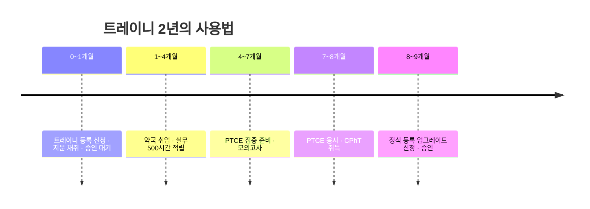

텍사스에서는 **Texas State Board of Pharmacy(TSBP)에 등록되어 ACTIVE 상태가 되기 전에는** 약국 테크니션 업무를 할 수 없습니다. 자격증 유무와 무관하게 별도로 밟아야 하는 절차입니다.

등록 종류는 두 가지입니다.

| 구분 | Pharmacy Technician Trainee | Pharmacy Technician |
|---|---|---|
| 국가 자격증 | 불필요 | **필수**(PTCE 또는 ExCPT 합격) |
| 유효기간 | **2년, 갱신 불가, 평생 1회** | 2년, 갱신 가능 |
| 수수료 | 약 **$55** | 약 **$84** (갱신 약 $81) |
| CE 요건 | 없음 | 2년간 20시간(최초 등록 기간은 면제) |
| 용도 | 자격증 준비하며 현장에서 일하기 | 정식 테크니션으로 근무 |

## 1. 트레이니 등록 절차

1. **TSBP 온라인 포털에서 계정 생성** — 개인 계정을 만들고 "Initial Technician Trainee"로 신청
2. **신청서 작성** — 생년월일, SSN, 학력, 신원 관련 문항에 답변
3. **수수료 결제** — 약 $55
4. **자동 발송 이메일 3통 확인** — ① 신청서 사본 ② 결제 영수증 ③ **지문 채취 안내서**
5. **지문 채취(fingerprinting)** — 안내 메일의 링크에 포함된 **TSBP 서비스 코드**로 예약. 코드 없이 예약하면 결과가 TSBP로 전달되지 않아 다시 해야 합니다
6. **결과 대기** — 지문 결과 반영에 최대 10 영업일, 등록 발급까지 최소 3주를 잡으세요
7. **ACTIVE 확인 후 근무 시작** — 등록번호가 나오고 상태가 ACTIVE가 되기 전에는 업무를 시작하면 안 됩니다


가장 흔한 실수 두 가지입니다.
1. **서비스 코드 없이 지문 채취** → 비용을 다시 내고 재촬영
2. **승인 전 근무 시작** → 본인뿐 아니라 감독 약사와 약국에도 징계 사유가 됩니다


## 2. 정식 등록으로 전환(업그레이드)

PTCE 또는 ExCPT에 합격하면 트레이니 등록을 **Pharmacy Technician**으로 업그레이드합니다.

- 신청은 같은 TSBP 포털에서 업그레이드 메뉴로 진행
- 자격증 번호(certification number)와 취득일을 입력
- 수수료 약 $84(2년)
- **트레이니 등록 만료 전에 완료해야 합니다.** 트레이니는 갱신도, 재발급도 되지 않습니다

여유를 두고 잡아도 1년 안에 끝나는 일정입니다. 2년을 꽉 채워 쓰다가 만료를 맞으면 되돌릴 방법이 없으니, **1년 안에 끝낸다는 목표**로 진행하세요.

## 3. 기본 요건

- 고등학교 졸업장 또는 GED (미보유 시 최대 2년의 유예)
- 영어로 업무 수행 가능
- 신원 조회 통과(지문 포함)
- TSBP는 최소 연령을 별도로 명시하지 않으며, 재학 중에도 트레이니 등록이 가능합니다

## 4. 갱신과 CE

- **2년마다 갱신**, 갱신 수수료 약 $81
- **CE 20시간** — 그중 **최소 1시간은 텍사스 약사법·규정** 관련이어야 합니다
- 최초 등록 기간에는 CE가 면제되고, 트레이니는 CE 요건이 없습니다
- CE는 [FreeCE](https://www.freece.com/), [Power-Pak C.E.](https://www.powerpak.com/) 같은 ACPE 인정 제공처에서 무료로도 채울 수 있습니다

## 5. 주소·이름 변경

이사하거나 이름이 바뀌면 정해진 기간 안에 TSBP에 신고해야 합니다. 갱신 통지가 옛 주소로 가서 만료되는 사고가 실제로 자주 발생합니다. 포털에 로그인해 연락처를 최신으로 유지하세요.

## 출처

- [Obtaining Pharmacy Technician Registration — TSBP](https://www.pharmacy.texas.gov/pharmacytechs.asp)
- [Pharmacy Technician Trainee Registration Application — TSBP](https://www.pharmacy.texas.gov/techtrainee.asp)
- [Upgrade Your Trainee Registration — TSBP](https://www.pharmacy.texas.gov/Upgradetech.asp)
- [Registered Technician Renewal — TSBP](https://www.pharmacy.texas.gov/techrenewal.asp)
