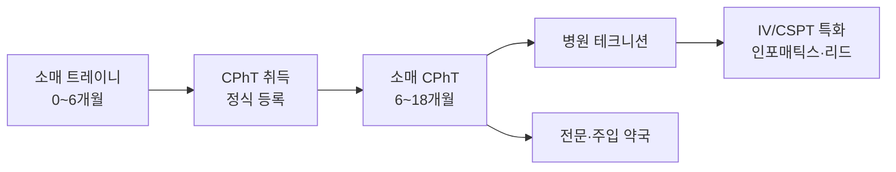

첫 직장을 어디로 잡느냐에 따라 이후 경로가 갈립니다. 아래는 현실적인 비교입니다.

## 한눈에 비교

| 항목 | 소매(Retail) | 병원(Hospital) | 전문/주입(Specialty) | 메일오더 |
|---|---|---|---|---|
| 신입 진입 | **쉬움** | 어려움 | 중간 | 중간 |
| 자격증 요구 | 트레이니 가능 | 대부분 필수 | 대부분 필수 | 선호 |
| 시급 | 낮음~중간 | **높음** | 중간~높음 | 중간 |
| 근무 시간 | 저녁·주말 포함 | 교대(야간 수당) | 주간 사무직에 가까움 | 교대 |
| 고객 응대 | 매우 많음 | 적음 | 전화 응대 많음 | 적음 |
| 배울 것 | 처방 처리·보험 청구 전반 | IV 조제, 마약류 관리, 병동 업무 | PA, 고가 약물 관리 | 자동화·대량 처리 |

## 소매 약국

**CVS, Walgreens, H-E-B, Walmart, Kroger, Costco**

- 경력이 없어도 트레이니로 채용하는 거의 유일한 경로
- 다수 체인이 **사내 교육 프로그램과 시험 응시료 지원**을 제공 (PTCB Pathway 1로도 활용 가능)
- 처방 접수, 보험 청구, 재고, 백신 접종 지원 등 업무 범위가 넓어 기본기가 빠르게 쌓임
- 단점: 바쁜 시간대의 압박, 고객 응대 스트레스, 상대적으로 낮은 시급


**H-E-B**는 텍사스 기반 대형 그로서리 체인으로, 직원 처우와 근무 분위기에 대한 평이 좋은 편이라 텍사스 현지에서 인기 있는 선택지입니다.


## 병원

**Texas Medical Center 계열, Baylor Scott & White, Methodist, HCA, Memorial Hermann, Ascension Seton**

- 시급과 복리후생이 가장 좋은 축
- 대부분 **CPhT + 텍사스 정식 등록**을 요구하고, 소매 경력 1년 이상을 요구하는 공고가 많음
- 업무: IV 무균 조제, 병동 자동조제기(Pyxis 등) 보충, 마약류 계수, 응급 카트 점검
- 야간·주말 수당이 붙어 실수령이 올라감
- 내부 이동으로 인포매틱스, 종양약국, 임상시험 지원 등으로 확장 가능

## 전문·주입 약국

- 항암제, 자가면역 생물학제제 등 고가 약물 취급
- 보험 사전승인(PA), 환자 등록, 재정 지원 프로그램 연결 등 **행정 업무 비중이 큼**
- 전화·서류 업무에 강하면 잘 맞고, 근무 시간이 규칙적인 편

## 메일오더·중앙조제

- 자동화 라인에서 대량 처리. 생산량 지표가 있음
- 환자 응대가 거의 없어 영어 회화 부담이 적음 — 영어가 아직 부담스러운 초기에 고려할 만함
- 반복 업무라 지루할 수 있고, 배우는 폭은 좁음

## 장기요양(LTC)

- 요양시설 대상 조제. 야간 교대가 많고 자리가 비교적 자주 남
- 블리스터 포장, 사이클 필(cycle fill) 등 소매와 다른 업무 흐름

## 추천 경로

첫 직장에서 오래 버티는 것보다, **1년 안에 자격을 갖추고 조건이 나은 곳으로 옮기는 것**이 텍사스 시장에서 일반적인 성장 경로입니다.
