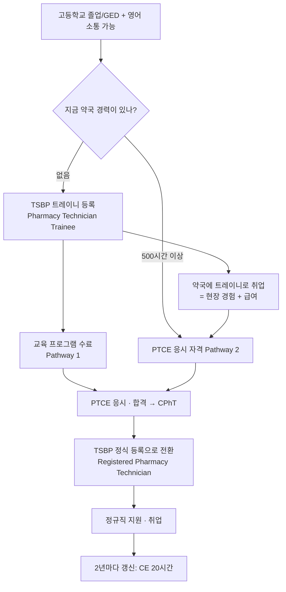

텍사스에서 약국 테크니션으로 일하기까지의 전 과정입니다. 순서를 잘못 잡으면 시간과 돈이 새기 때문에, 먼저 큰 그림을 잡고 시작하세요.

## 한 장 요약

## 단계별 상세

### 1단계 — 기본 요건 확인

| 항목 | 요건 |
|---|---|
| 학력 | 고등학교 졸업장 또는 GED (미보유 시 TSBP는 최대 2년의 유예를 둠) |
| 언어 | 영어로 업무 수행이 가능해야 함 (처방 확인·환자 응대) |
| 신원 | 범죄 경력 조회 통과, 지문 채취 필수 |
| 신분 | PTCB는 미국 시민권자 또는 합법적 거주자를 요구함 — 본인 신분으로 취업이 가능한지 먼저 확인 |


신분(비자) 문제는 자격증보다 먼저 확인해야 할 항목입니다. 취업 허가가 없는 상태에서는 자격증이 있어도 채용이 되지 않습니다.


### 2단계 — TSBP 트레이니 등록 (경력이 없다면)

미국에서 약국 경력이 없다면 대부분 여기서 시작합니다. **Pharmacy Technician Trainee**로 등록하면 자격증이 없는 상태에서도 약사의 감독 아래 합법적으로 일하며 경험을 쌓을 수 있습니다.

- 신청은 TSBP 온라인 포털에서, 수수료는 약 **$55(2년)**
- 트레이니 등록은 **평생 1회, 최대 2년**만 유효하고 갱신되지 않음
- 이 2년 안에 국가 자격증을 따서 정식 등록으로 **업그레이드**해야 함

자세한 절차 → [텍사스 주 등록](../certification/texas-registration/)

### 3단계 — PTCE 응시 자격 만들기

PTCB는 두 가지 경로 중 하나를 요구합니다.

- **Pathway 1** — PTCB가 인정하는 교육/훈련 프로그램 수료
- **Pathway 2** — 동등한 약국 실무 경력 **500시간 이상**

트레이니로 취업해 일하면서 500시간을 채우는 경로(2단계 → Pathway 2)가 비용 면에서 가장 현실적입니다. 반대로 빠르게 자격을 갖추고 싶다면 커뮤니티 칼리지나 온라인 프로그램을 수료하는 Pathway 1이 빠릅니다.

### 4단계 — PTCE 시험 준비와 응시

- 문항 수 90문항(채점 80 + 미채점 10), 제한 시간 110분, 합격 점수 1400점
- 응시료 **$129**
- 2026년 1월 6일부터 **개정 출제 범위** 적용 — 조제(compounding) 문항이 빠지고 연방 법규 비중이 커짐

준비 방법 → [PTCE 시험 개요](../certification/ptcb/) · [8주 학습 계획](../certification/study-plan/)

### 5단계 — 정식 등록으로 전환

자격증을 받으면 TSBP에 **Registered Pharmacy Technician**으로 업그레이드를 신청합니다. 등록 수수료는 약 **$84(2년)**이며, 지문 결과 반영과 승인까지 여유 있게 3주 이상을 잡아야 합니다.

### 6단계 — 취업

정식 등록이 나오면 지원 가능한 자리가 크게 넓어집니다(특히 병원·전문약국). 채용 시장과 지원 전략은 [취업 섹션](../jobs/)에서 다룹니다.

### 7단계 — 유지

- TSBP 등록은 **2년마다 갱신**, 갱신 시 **CE 20시간**(그중 최소 1시간은 텍사스 약사법)
- PTCB CPhT도 별도로 2년마다 재인증(CE 20시간)이 필요

## 예상 기간과 비용

| 항목 | 금액(대략) | 비고 |
|---|---|---|
| 트레이니 등록 | $55 | 2년, 1회 한정 |
| 지문 채취 | $40 내외 | 벤더 수수료 |
| PTCE 응시료 | $129 | 재응시 시 별도 |
| 교육 프로그램(선택) | $0 ~ $1,500+ | 고용주 지원 프로그램이면 무료인 경우도 있음 |
| 정식 등록 | $84 | 2년 |
| **합계** | **$310 ~ $1,800** | 경로에 따라 차이가 큼 |

기간은 트레이니로 일하며 준비할 경우 **6~12개월**, 교육 프로그램을 이수하며 집중적으로 준비할 경우 **3~6개월**이 일반적입니다.


위 금액은 공개된 자료를 정리한 참고값입니다. 신청 화면에 표시되는 금액이 항상 우선합니다.


## 다음 단계


  
  

