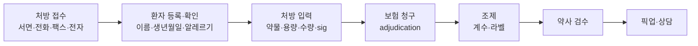

처방이 들어와 환자 손에 나가기까지의 전 과정입니다. 실제 업무의 대부분이 여기에 해당합니다.

## 처방 접수부터 픽업까지

## 처방전 필수 기재사항

- 환자 이름·주소, 처방 날짜
- 약물명·규격·수량, 용법(sig)
- 리필 횟수
- 처방자 이름·주소·서명, **DEA 번호**(규제약물의 경우)


**CII 처방은 리필이 불가**합니다. 전자 처방(EPCS) 또는 서면 원본이 원칙이며, 응급 상황의 구두 처방은 제한된 양과 후속 서면 제출 조건이 붙습니다.


## DEA 번호 검증

형식: 문자 2개 + 숫자 7개 (예: **AB1234563**)

- 첫 글자: 등록자 유형(A/B/F/G = 병원·약국·의사 등, M = 중급 실무자)
- 둘째 글자: 처방자 성(last name)의 첫 글자
- 검증(체크섬):
  1. 1·3·5번째 숫자를 더한다
  2. 2·4·6번째 숫자를 더해 2를 곱한다
  3. 두 값을 더했을 때 **일의 자리가 7번째 숫자(체크 디지트)와 같아야** 한다

**예제** — AB1234563
(1+3+5) = 9, (2+4+6) = 12 → 12 × 2 = 24, 9 + 24 = 33 → 일의 자리 3 = 체크 디지트 3 ✓

## NDC 번호

**11자리, 5-4-2 형식**

| 구획 | 의미 |
|---|---|
| 첫 5자리 | 제조사(labeler) |
| 다음 4자리 | 제품(product) — 성분·규격·제형 |
| 마지막 2자리 | 포장(package) — 용량·수량 |

바코드 스캔이 실패하면 NDC를 눈으로 대조합니다. **제조사가 바뀌면 앞 5자리가 달라집니다.**

## 보험 청구 (Third-Party Adjudication)

필요한 정보: **BIN, PCN, Group, Member ID**, 그리고 person code.

### 자주 만나는 거절과 대응

| 거절 사유 | 원인 | 대응 |
|---|---|---|
| Refill Too Soon | 아직 이전 조제분이 남아 있음 | 가능 날짜 안내, 여행 등은 vacation override 요청 |
| Prior Authorization Required | 보험사 사전 승인 필요 | 처방자 사무실에 PA 요청 전달 |
| NDC Not Covered | 처방된 제품이 비급여 | 대체 가능 제네릭·처방집(formulary) 대안 확인 |
| Missing/Invalid Member ID | 정보 오타·보험 변경 | 카드 재확인 |
| Quantity Limit Exceeded | 수량 제한 초과 | 처방자 확인 또는 PA |
| Non-Matched Prescriber ID | NPI 오류 | 처방자 정보 수정 |

**DAW 코드** — 0: 대체 허용(기본), 1: 처방자가 브랜드 지정, 2: 환자가 브랜드 요구.

## 재고 관리

- **선입선출(FEFO/FIFO)** — 유효기간이 빠른 것부터
- **유효기간 관리** — 월 단위 점검, 임박 재고 반품(reverse distributor)
- **par level** — 최소 재고 기준, 미달 시 자동 발주
- **규제약물 재고** — CII는 별도 장부(perpetual inventory)와 실사
- **리콜 처리** — 로트 번호 조회, 격리, 반품, 필요 시 환자 통지

## 조제 실무 체크포인트

1. 라벨 정보: 환자명, 약물·규격, sig(영어 지시문), 수량, 리필, 유효기간, 경고 문구
2. **보조 라벨(auxiliary label)** — "Take with food", "May cause drowsiness", "Do not drink alcohol"
3. 재구성이 필요한 현탁액은 물의 양과 보관 조건을 정확히
4. **아동 보호 뚜껑(child-resistant)** — 환자가 서면으로 요청하면 면제 가능
5. 픽업 시 신규·변경 처방은 **약사 상담** 연결


